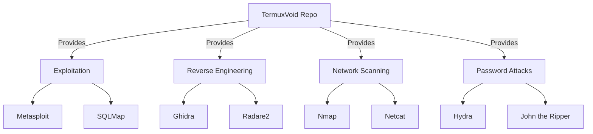

<div align="center">
  <a href="https://termuxvoid.github.io/">
    
    <h1>TermuxVoid APT Repository</h1>
  </a>
  <p><b>🔓 100+ Ethical Hacking & Pentesting Packages — Beyond Official Repositories</b></p>

  <div>
    <a href="https://github.com/TermuxVoid/repo/stargazers">
      
    </a>
    <a href="https://github.com/TermuxVoid/repo/blob/main/LICENSE">
      
    </a>
    <a href="https://github.com/TermuxVoid/repo/issues">
      
    </a>
  </div>
</div>

---

## 🔍 Project Overview

**TermuxVoid** bridges the gap between mobile convenience and professional security auditing. We host **100+ advanced security tools** that are not available in the official Termux repositories, specifically compiled and optimized for Android architecture.

Whether you are a professional penetration tester or an ethical hacking enthusiast, TermuxVoid turns your Android device into a portable powerhouse.

> [!NOTE]
> This repository contains tools that are often excluded from official sources due to complexity or licensing. All packages are compiled natively for Termux.

## 🚀 Quick Installation

Getting started is seamless. Run the following one-liner in your Termux terminal to add the repository automatically.

```bash
curl -sL https://termuxvoid.github.io/repo/install.sh | bash
```

> [!TIP]
> After installation, run `pkg update` to refresh your local package database. You can then search for tools using `pkg search <tool-name>`.

## ✨ Featured Tools

We provide a curated selection of industry-standard tools. Here are some highlights:

<div align="center">

| Tool | Category | Description |
| :--- | :--- | :--- |
| **Metasploit Framework** | `Exploitation` | The world's most used penetration testing framework. |
| **Burp Suite** | `Web Security` | Leading toolkit for web application security testing. |
| **Ghidra** | `Reverse Eng.` | NSA's high-end software reverse engineering suite. |
| **THC Hydra** | `Password Cracking` | Fast network logon cracker supporting many protocols. |
| **SQLMap** | `Web Security` | Automatic SQL injection and database takeover tool. |

</div>

<details>
<summary><b>📊 View Mermaid Architecture</b></summary>


</details>

## ⚠️ Legal & Disclaimer

> [!WARNING]
> These tools are provided strictly for **educational purposes** and **authorized security testing**. Using these tools against systems without explicit permission is illegal. The maintainers of TermuxVoid are not responsible for any misuse or damage caused by these programs.

## ❓ Frequently Asked Questions

<details>
<summary><b>Are these tools safe to use on a personal device?</b></summary>
<br>
Yes, all packages are compiled from source or verified binaries. However, these are powerful security tools; ensure you understand what a tool does before executing it to avoid unintended system modifications.
</details>

<details>
<summary><b>Why aren't these in the official repo?</b></summary>
<br>
Many of these tools (like Metasploit or Ghidra) have heavy dependencies, large sizes, or licensing complexities that make them difficult to maintain in the official core repositories. We handle the heavy lifting so you don't have to.
</details>

<details>
<summary><b>How do I request a new package?</b></summary>
<br>
We are constantly expanding. You can request new tools via:
  
1. Opening a **[GitHub Issue](https://github.com/TermuxVoid/repo/issues)**
2. Contacting us on Telegram: **[TermuxVoid](https://t.me/termuxvoid)**
</details>

> [!NOTE]
> We now also host **root packages**. See [root-repo.md](root-repo.md) for details.

## 🌐 Support & Community

Join our growing community of security researchers and mobile hackers.

<div align="center">
  <a href="https://t.me/nullxvoid">
    
  </a>
  <a href="https://youtube.com/@alienkrishnorg">
    
  </a>
  <a href="https://github.com/TermuxVoid/repo">
    
  </a>
</div>

---

## 🛠️ Contribution & Support

Support the project to help us keep the packages updated and add more tools:

- ⭐ **Star** this repository to show your support.
- 🐛 **Report Bugs** responsibly via Issues.
- 📢 **Share** with the security community.

[View Complete Package List »](PACKAGES.md)

<div align="center">
  <sub>Built with ❤️ for security researchers | Termux-optimized builds</sub>

