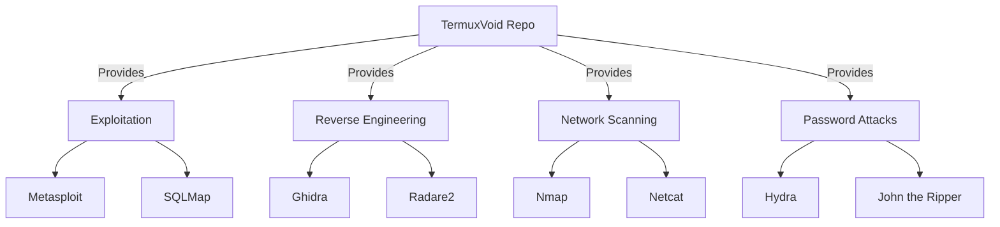

<div align="center">
  <a href="https://termuxvoid.github.io/">
    
    <h1>TermuxVoid APT Repository</h1>
  </a>
  <p><b>🔓 Unofficial APT Repository: 192+ Ethical Hacking & Pentesting Packages</b></p>

  <div>
    <a href="https://github.com/TermuxVoid/repo/stargazers">
      
    </a>
    <a href="https://github.com/TermuxVoid/repo/blob/main/LICENSE">
      
    </a>
    <a href="https://github.com/TermuxVoid/repo/issues">
      
    </a>
  </div>
</div>

## 📖 Table of Contents

- [Project Overview](#-project-overview)
- [Prerequisites](#-prerequisites)
- [Quick Installation](#-quick-installation)
- [Featured Tools](#-featured-tools)
- [Legal & Disclaimer](#-legal--disclaimer)
- [Frequently Asked Questions](#-frequently-asked-questions)
- [Support & Community](#-support--community)
- [Contribution & Support](#-contribution--support)

---

## 📋 Prerequisites

Before using TermuxVoid, ensure your environment meets these requirements:

- **Termux** installed from [F-Droid](https://f-droid.org/en/packages/com.termux/) (recommended) or GitHub
- **Android 7+** with ~2GB free storage for larger tools
- **Working internet connection** for package downloads
- **No root required** for most tools (some may need root for certain features)

---

## 🔍 Project Overview

**TermuxVoid** is an **unofficial custom APT repository** that bridges the gap between mobile convenience and professional security auditing. We host **192+ advanced security tools** that are not available in the official Termux repositories, specifically compiled and optimized for Android architecture.

Whether you are a professional penetration tester or an ethical hacking enthusiast, TermuxVoid turns your Android device into a portable powerhouse.

> [!NOTE]
> This repository contains tools that are often excluded from official sources due to complexity or licensing. All packages are compiled natively for Termux.<br>

## 🔍 Why Open Source?

So you see exactly what runs on your device before it runs. Every package is built from source — nothing is hidden. No TermuxVoid package touches `$PATH`, `$HOME`, or any Termux environment variable. We use **symlinks** instead of env mutations; uninstall leaves zero trace. Don't trust — verify.

## 🚀 Quick Installation

Getting started is seamless. Run the following one-liner in your Termux terminal to add the repository automatically:

```bash
# Add repository
curl -sL https://github.com/termuxvoid/repo/raw/main/install.sh | bash
```

Once the repository is added, you can install any tool using `pkg install`:

```bash
# Install any tool
pkg install <tool-name>

# Example
pkg install metasploit-framework
```

> [!TIP]
> After installation, run `pkg update` to refresh your local package database. You can search for tools using `pkg search <tool-name>`.

## ✨ Featured Tools

We provide a curated selection of industry-standard tools. Here are some highlights:

<div align="center">

| Tool | Category | Description |
| :--- | :--- | :--- |
| **Metasploit Framework** | `Exploitation` | The world's most used penetration testing framework. |
| **Burp Suite** | `Web Security` | Leading toolkit for web application security testing. |
| **Ghidra** | `Reverse Eng.` | NSA's high-end software reverse engineering suite. |
| **THC Hydra** | `Password Cracking` | Fast network logon cracker supporting many protocols. |
| **SQLMap** | `Web Security` | Automatic SQL injection and database takeover tool. |

</div>

<details>
<summary><b>📊 View Mermaid Architecture</b></summary>


</details>

<div align="center">
  <a href="assets/PACKAGES.md">
    
  </a>
</div>

## 🧠 AI Agents

| Tool | Description |
| :--- | :--- |
| **opencode** | AI-powered coding assistant |
| **antigravity-cli** | AI coding assistant (glibc wrapper) |
| **copilot-cli** | GitHub Copilot CLI — AI-powered assistance in your terminal |
| **mimocode** | Autonomous AI engineer — creates, modifies, tests, deploys code |
| **openclaude** | Open-source coding-agent CLI for cloud & local LLMs |
| **hermes-agent** | AI-powered coding assistant and workflow automation tool |

## ⚠️ Legal & Disclaimer

> [!WARNING]
> Educational purpose only. Do not use your knowledge for illegal things. I won't take any responsibility about your doing — you do illegal shit you end up in jail yourself. Know your laws, stay ethical, and don't be a criminal.

## ❓ Frequently Asked Questions

<details>
<summary><b>Are these tools safe to use on a personal device?</b></summary>
<br>
Yes, all packages are compiled from source or verified binaries. However, these are powerful security tools; ensure you understand what a tool does before executing it to avoid unintended system modifications.
</details>

<details>
<summary><b>Are these tools legal to use?</b></summary>
<br>
All tools are for <strong>legal security research and ethical hacking purposes only</strong>. Always obtain proper authorization before testing systems you do not own.
</details>

<details>
<summary><b>Why aren't these in the official repo?</b></summary>
<br>
Many of these tools (like Metasploit or Ghidra) have heavy dependencies, large sizes, or licensing complexities that make them difficult to maintain in the official core repositories. We handle the heavy lifting so you don't have to.
</details>

<details>
<summary><b>How often are tools updated?</b></summary>
<br>
- Security patches within 24 hours
- Version updates every Sunday
- Emergency fixes as needed
</details>

<details>
<summary><b>How do I request a new package?</b></summary>
<br>
We are constantly expanding. You can request new tools via:

1. Opening a **[GitHub Issue](https://github.com/TermuxVoid/repo/issues)**
2. Contacting us on Telegram: **[Telegram @nullxvoid](https://telegram.me/nullxvoid)**
3. Sending an email to: **[termuxvoid@gmail.com](mailto:termuxvoid@gmail.com)**
</details>

<details>
<summary><b>How do I report a broken package?</b></summary>
<br>
Open an issue on **[GitHub](https://github.com/TermuxVoid/repo/issues)** with the tool name and error output. We aim to fix reported issues within 24 hours.
</details>

<details>
<summary><b>How do I uninstall the TermuxVoid repository?</b></summary>
<br>
To remove the repository from your Termux environment:

```bash
rm $PREFIX/etc/apt/sources.list.d/termuxvoid.list
rm $PREFIX/etc/apt/trusted.gpg.d/termuxvoid.gpg
apt update
```

This removes the repository source and its GPG key without affecting already-installed packages.
</details>

<details>
<summary><b>I get a "package not found" error — what should I do?</b></summary>
<br>
Ensure you have run `pkg update` after adding the repository. If the issue persists, try:

```bash
apt update
pkg search <tool-name>
```

If the tool still doesn't appear, it may have a different package name — check the **[full package list](assets/PACKAGES.md)** for the exact name.
</details>

## 🌐 Support & Community

Join our growing community of security researchers and mobile hackers.

<div align="center">
  <a href="https://telegram.me/nullxvoid">
    
  </a>
  <a href="https://youtube.com/@alienkrishnorg">
    
  </a>
  <a href="https://github.com/TermuxVoid/repo">
    
  </a>
</div>

---

## 🛠️ Contribution & Support

Support the project to help us keep the packages updated and add more tools:

- ⭐ **Star** this repository to show your support.
- 🐛 **Report Bugs** responsibly via Issues.
- 📢 **Share** with the security community.

[View Complete Package List »](assets/PACKAGES.md)

<div align="center">
  <sub>Built with ❤️ for security researchers by <a href="https://github.com/Anon4You">Alienkrishn</a> | Termux-optimized builds</sub>
</div>

