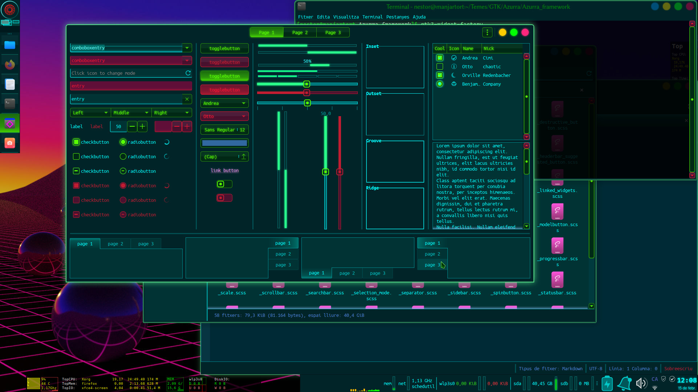
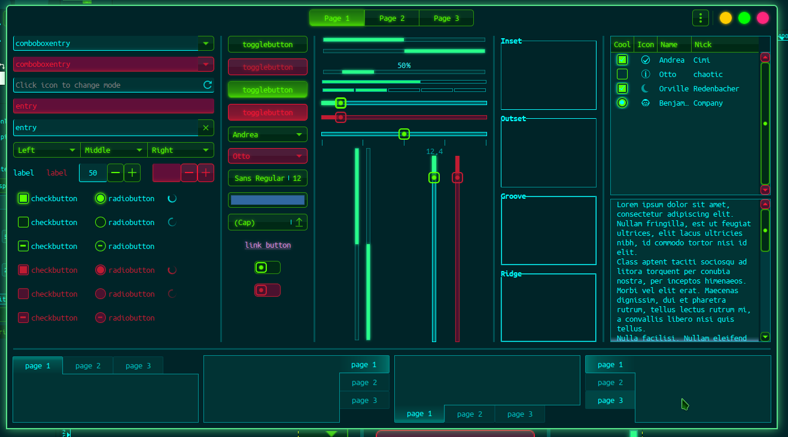
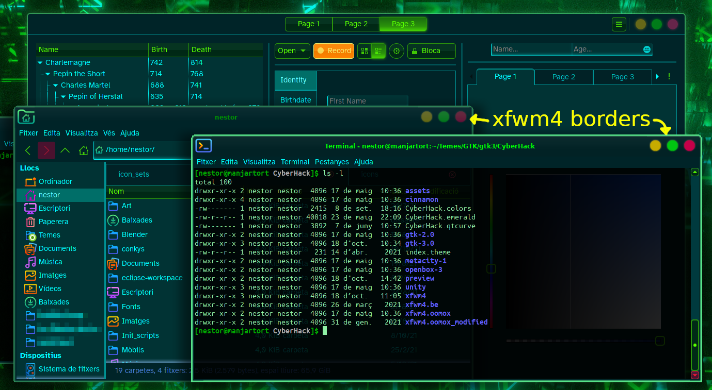
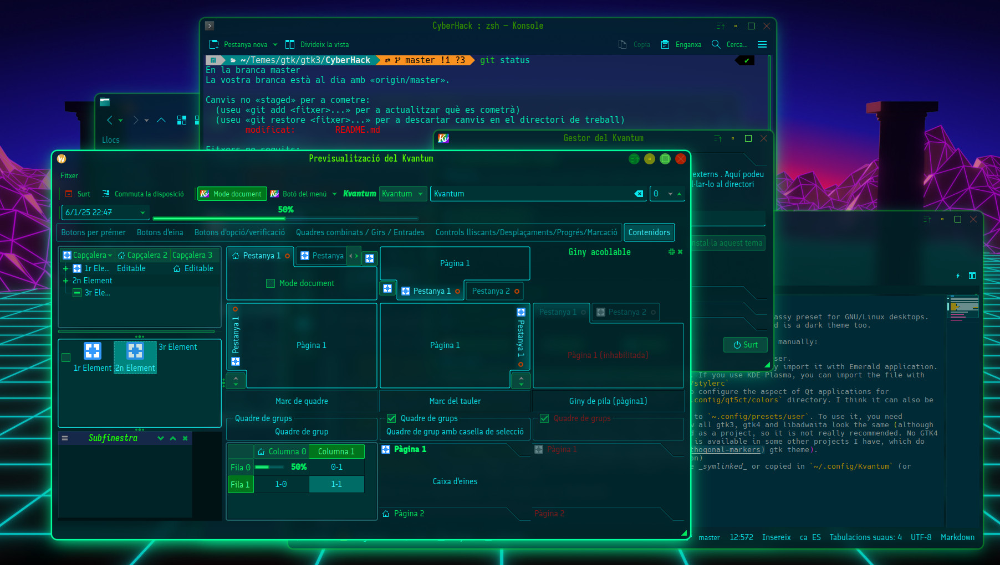

# CyberHack

CyberHack is a GTK2, GTK3, xfwm4, Cinnamon, Emerald, qtCurve, Kvantum, Plasma color scheme and Klassy preset for GNU/Linux desktops.
It's hacker-looking, futuristic, cyberpunkish and glowing. Its main colors are cyan and green, and is a dark theme too.

There are also some files useful for other environments, which need to be installed or configured manually:

- `CyberHack.colors`: KDE Plasma Color scheme, needs to be imported from Plasma Color Scheme chooser.
- `CyberHack.emerald`: Emerald theme if you use Compiz with Emerald (old Beryl) decorator. You may import it with Emerald application.
- `CyberHack.qtcurve`: QtCurve configuration so it looks great with this theme. If you use KDE Plasma, you can import the file with Qturve configuration. If not, copy its contents to the file `~/.config/qtcurve/stylerc`
- `CyberHack-qt5ct_colors.conf`: This is a color scheme fot Qt5ct, a utility to configure the aspect of Qt applications for environments other than KDE Plasma. To use it, you need to copy it to your `~/.config/qt5ct/colors` directory. I think it can also be used for qt6ct (`~/.config/qt6ct/colors`).
- `cyberhack-improved.json`: This is a Gradience preset, that you need to copy to `~.config/presets/user`. To use it, you need [Gradience program](https://github.com/GradienceTeam/Gradience). With this, now all gtk3, gtk4 and libadwaita look the same (although not exactly as with the "native" gtk3 theme). Note: Gradience has been archived as a project, so it is not really recommended. No GTK4 version of this theme is available directly (although CyberHack's color scheme is available in some other projects I have, which do support GTK4, such as [orthogonal-markers](https://git.disroot.org/eudaimon/orthogonal-markers) gtk theme).
- `CyberHack.klpw`: this is a Klassy preset (for Klassy Plasma window decoration)
- `Kvantum/CyberHack`: Kvantum theme for QT's Kvantum engine for widgets. To be _symlinked_ or copied in `~/.config/Kvantum` (or imported with Kvantum's import folder option)

Kora, BeautyLine or BeautySolar icon themes are recommended.

